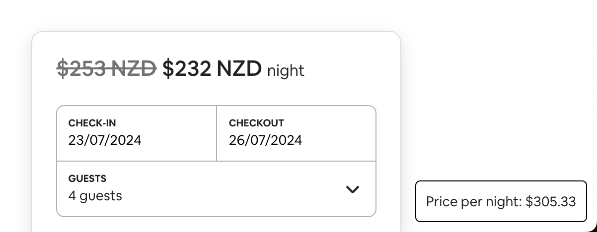

# Airbnb Price Fixer

A simple chrome extension that fixes the airbnb price night cost.
Shows a floating box that has the actual nightly cost for a listing:



## Project Structure

- src/typescript: TypeScript source files
- src/assets: static files
- dist: Chrome Extension directory
- dist/js: Generated JavaScript files

## Setup

```
npm install
```

## Import as Visual Studio Code project

...

## Build

```
npm run build
```

## Build in watch mode

### terminal

```
npm run watch
```

### Visual Studio Code

Run watch mode.

type `Ctrl + Shift + B`

## Load extension to chrome

Load `dist` directory

## Test

`npx jest` or `npm run test`
